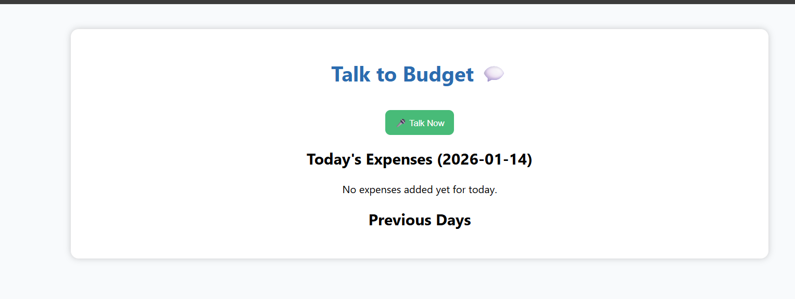
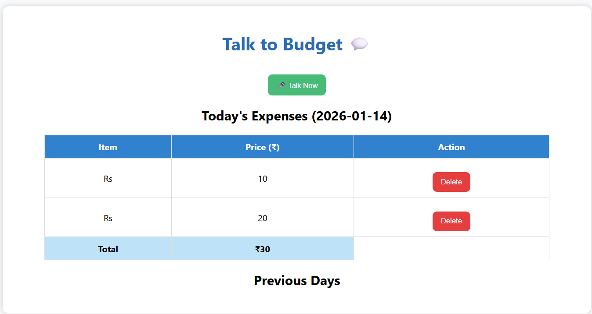

# Talk2Budget 💰

## 📌 Project Description
Talk2Budget is a smart budgeting application that helps users manage expenses, track spending, and maintain financial discipline efficiently.

---

## 🚀 Features
- User authentication
- Expense tracking
- Budget management
- Simple and clean UI
- Secure data handling

---

## 🛠️ Tech Stack
- Frontend: HTML, CSS, JavaScript
- Backend: Flask (Python)
- Database: SQLite / SQLAlchemy

---

## 🖥️ UI Screenshots

### 🔐 Login Page

---

### 📊 Dashboard Page

---

## 📂 Project Structure
Talk2Budget/
│
├── app.py
├── templates/
├── static/
├── screenshots/
│ ├── login.png
│ └── dashboard.png
├── README.md
└── requirements.txt
